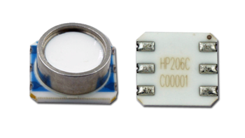

# HP206(C/F)



https://www.hoperf.com/sensor/pressure_sensor/HP206C.html

https://www.hoperf.com/sensor/pressure_sensor/HP206F.html

## Available interfaces

### Generic

File suffix: `generic`.

Generic implemenration of inferface that use two function for I2C communication:

`i2c1_write(uint8_t <I2C address>, uint8_t <data buffer>, uint8_t <data length>)`
`i2c1_read(uint8_t <I2C address>, uint8_t <data buffer>, uint8_t <data length>)`

## Example

```c
uint32_t pressure = 0;

hp206_init(1); // with enabled compensation
hp206_start(HP206_ADC_CVT_CHNL_PT, HP206_ADC_CVT_OSR_512);
hp206_read_p(&pressure);
```
